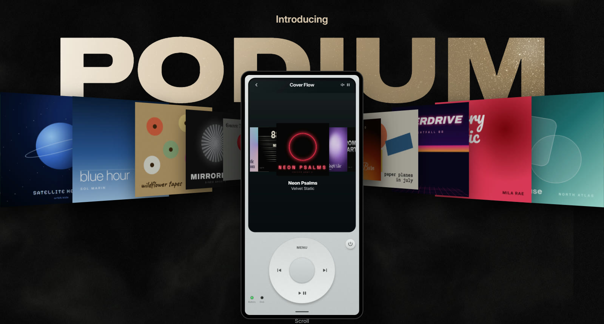
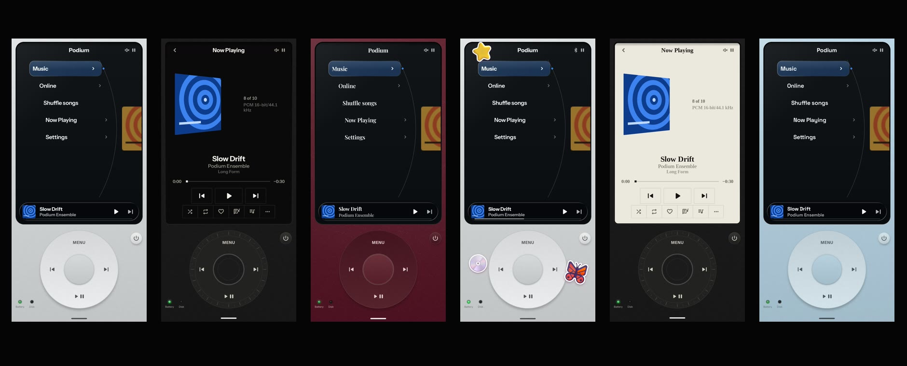

<p align="center">
  <a href="https://podium-music-player.vercel.app/"></a>
</p>

<h1 align="center">Podium</h1>

<p align="center"><b>The wheel is back.</b> A music player for Android that lives inside one beautifully engineered device.</p>

<p align="center">
  <a href="https://github.com/GHOSTxASR/podium-music-player/releases/latest/download/podium.apk"></a>
  <a href="https://github.com/GHOSTxASR/podium-music-player/releases/latest"></a>
  <a href="LICENSE"></a>
  
</p>

<p align="center"><a href="https://podium-music-player.vercel.app/">Website</a>&nbsp;&nbsp;|&nbsp;&nbsp;<a href="https://github.com/GHOSTxASR/podium-music-player/releases/latest">Releases</a>&nbsp;&nbsp;|&nbsp;&nbsp;<a href="docs/README.md">Documentation</a></p>

---

Every music app looks the same. Podium brings back the wheel: one wheel to move, one button to
choose, and everything about the device yours to change. Your own music comes first, an online
catalogue is built in, and there are no ads and no analytics.

<p align="center"></p>

## Download

1. Download **[podium.apk](https://github.com/GHOSTxASR/podium-music-player/releases/latest/download/podium.apk)** from the latest release.
2. Open it on your phone. Android asks once to allow installs from your browser or file manager.
3. Open Podium and turn the wheel.

Needs Android 10 or later. Every release is signed with the same key, so new versions install over
old ones and keep your library, finishes and stickers.

## What's inside

| | |
|---|---|
| **One wheel** | Turn to move, press to choose, Menu to go back. Every turn clicks under your thumb. |
| **Cover Flow** | Your albums in perspective, the centre one facing you, its neighbours standing to either side. |
| **Lyrics** | Time-synced and revealed word by word, full screen, in the typeface you choose. |
| **Offline first** | Your own library, sorted by album and artist, with a database that remembers your queue. |
| **Online built in** | Search and stream a full catalogue with your own account. No ads. |
| **Background play** | The music keeps going when you leave, with lock-screen and Bluetooth controls. |
| **A real device** | A boot self-test and startup chord, a power button, battery and disk lights. |
| **Private** | No analytics, no crash reporters. Stickers are cut out on your phone. |

## Make it yours

- **17 typefaces** for the whole display, from Classic to Gothic, plus **7 faces just for lyrics**.
- **16.7 million colours.** Dial any finish with the wheel and watch the body change live.
- **6 finishes:** Glass, Silver, Steel gray, Burgundy, Glacier blue or your own colour.
- **4 display themes:** Glass, Carbon, Bone and Custom, with your own picture behind it all.
- **Glitter** set into the body that catches the light as you tilt your phone.
- **Stickers** cut from your photos, stuck anywhere on the device, even over the screen.
- **Step outside:** pinch to lift your Podium out of the screen and hold it like an object.

## Build from source

Requirements: JDK 21 and the Android SDK.

```bash
./gradlew :app:assembleDebug     # app.podium.debug, with test tones and debug commands
./gradlew :app:assembleRelease   # app.podium, minified; signed when keystore.properties exists
```

Release signing reads `keystore.properties` (never committed) or `PODIUM_KEYSTORE_*` environment
variables; see [docs/deployment.md](docs/deployment.md). Architecture, decisions and testing live in
[docs/](docs/README.md). The website is in [site/](site/README.md).

## License

Podium is free software, licensed under the [GNU General Public License v3.0](LICENSE).

It builds on [NewPipeExtractor](https://github.com/TeamNewPipe/NewPipeExtractor) (GPL-3.0), Google's
MediaPipe MagicTouch model and the LiteRT runtime (Apache-2.0), AndroidX and Media3 (Apache-2.0), and
typefaces under the SIL Open Font License. Notices and license texts are in
[third_party/](third_party/). Podium is an independent project, not affiliated with any music
service or hardware maker; online services are used under their own terms.
